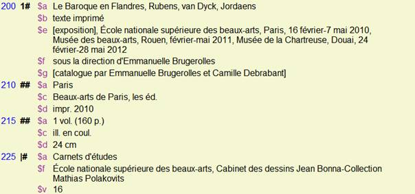

# db.print()
Loïc Horellou, Jérôme Saint-Loubert Bié

### 3e année Communication graphique 2e semestre 2015-2016:

Nous sommes actuellement dans une période de forte convergence des outils informatiques. Les outils de publication assistée par ordinateur (xPress, inDesign), à l'origine développés pour le papier, permettent de plus en plus la conception de projets sur écran (sites Web, projets éditoriaux pour tablettes tactiles, slideshow plus ou moins interactifs,…). D’un autre côté les langages de programmation Web prennent en compte de plus en plus de médiums et de supports différents (écrans d’ordinateurs, mobiles, tactiles, projections, imprimés, …).

Vous concevrez un projet éditorial papier à partir d'une source numérique qui vous est proposée : le catalogue des bibliothèques de la Ville de Strasbourg.
Un catalogue de bibliothèque est une base de données (un ensemble de fiches) décrivant les ouvrages conservés. Chaque fiche contient un certain nombre d'informations suivant des catégories préétablies dont certaines peuvent être ou non renseignées.
Vous établirez une sélection afin de restreindre votre contenu à certaines catégories en fonction de vos centres d'intérêts. Parmi cette sélection de fiches, vous pourrez par ailleurs exploiter l'ensemble ou bien certains des champs disponibles.

Votre corpus devra être mis en forme de manière personnelle, qui fasse sens, et le design devra être en adéquation avec le contenu proposé. La base de donnée ne contient pas d'images, mais vous pouvez en ajouter, ou bien compléter par d'autres type de données qui vous semblent appropriées, dans ce cas à vous d'en déterminer la nature. 

À vous d’imaginer les systèmes de transposition de ces éléments sur un support imprimé : références croisées, index, sommaire. Vous questionnerez la notion de tri, d'ordre et de filtre. 

La maquette de l’édition sera issue d'un processus de mise en forme automatisé à l'aide des outils de traitement disponibles au sein du logiciel InDesign. Quelques exemples de fonctionnalités utilisables :

- scripts exécutés dans le terminal
- styles (de paragraphes, de caractères) appliqués à une structure XML
- gabarits
- expression régulières (GREP)
-  styles imbriqués
- scripts dans indesign
- fonctionnalités Open type dans une police de caractères

Le projet éditorial sera réalisé à échelle un et ne doit pas rester à l’état de principe ou de concept. Vous garderez une trace (carnets, processus, protocoles) du principe de mise en page automatique appliqué à votre contenu.

Pour la constitution de ce projet, vous produirez obligatoirement les éléments suivants :

- une note d’intention écrite
- des références bibliographiques et sitographiques
- des références visuelles 
- des éléments d’intention visuelle :
	- storyboard
	- arborescence
	- chemin de fer

**Mentions diverses :**
Votre projet devra impérativement comporter un titre, vos prénoms et nom, ainsi que la mention «produit dans le cadre du sujet db.print() de l'atelier de Communication graphique de la Haute école des arts du Rhin, Strasbourg, 2016», et le cas échéant «imprimé à la HEAR».

<small>\[Ce document a été formaté dans le style "Swiss" du logiciel Marked 2\]</small>

----

## Le format MARC

La notice du format [MARC](https://fr.wikipedia.org/wiki/Machine-Readable_Cataloging) sur wikipedia.

| Zone 200 = zone de titre ou bloc des informations descriptive |||  
|  ------	| ------	| ------	|
| Zone 200 |Sous zone $a|  =titre principal  |  
|  |Sous zone $b | =type de document |  
| |  Sous zone $e |  =sous-titre, complément de titre  |  
| |  Sous zone $f | =mention de responsabilité : auteur principal   |  
| |  Sous zone $g |  = mention d’auteur secondaire : préfacier, éditeur scientofique etc…  |  

Pour vérifier les différents champs qui peuvent être présents dans votre export de notice au format MARC, vous pouvez utiliser le logiciel [MarcEdit](http://marcedit.reeset.net/downloads). Il est compatible avec Linux, Windows et Mac OS X.

## Utiliser les scripts php

Bien lire les commentaires dans le fichier de script. Si vous constatez que vous allez utiliser un code qui nécessite certains fichiers, vérifiez bien que tous vos fichiers sont bien nommés.

- Ouvrir l'application terminal (sur windows cmd)
- écrire cd + espace + glisser le dossier contenant le script que vous souhaitez executer (sur windows : dir + espace + glisser le dossier contenant le script que vous souhaitez executer)
- appuyer sur entrée
- écrire `php index.php` (si votre script s'appelle index.php)
- appuyer sur entrée

## Récupérer les images

Pour récupérer les images, vous pouvez essayer de passer par un aspirateur de site internet comme [Site Sucker][2]. Celui devrait aspirer tout le contenu de votre site,sauf les images qui sont hébergées sur d'autres serveurs (pour vérifier, l'url principale de vos images doit être la même que celle de votre site internet).
Pour éviter ce problème nous allons passer par l'outil nommé Automator créé par Apple (pour ceux qui sont sur PC il doit y avoir d'autres solutions).

Automator est un outil de script du système d'exploitation, qui fonctionne avec une interface nodale simplifiée. La programmation se fait à travers l'agencement d'une série de boites qui s'imbriquent les unes dans les autres.

Le script que nous allons réaliser va se composer d'une séquence de 3 actions :

1. Obtenir la page web actuelle de safari :  
	On indique ici que l'on souhaite travailler avec la page de safari qui est actuellement consultée (n'oubliez pas d'ouvrir la page qui vous intéresse). Attention pour les sites qui ont un chargement d'images aléatoire, vous pouvez avoir une différence entre votre fichier de code archivé et le code de la page en cours de consultation. Pour éviter ce problème vous devriez pouvoir travailler avec le fichier source que vous avez archivé au format `.html`.
2. Obtenir le contenu des pages web  
	On explique à automator qu'il va travailler avec le code contenu dans la page.
3. Enregistrer les images du contenu web  
	Ici on va préciser dans le champ emplacement de la boite, le dossier dans lequel on va enregistrer les images. Vous placerez ce dossier dans le même répertoire que votre fichier xml.

![L'interface d'Automator][image-4]

## Exporter des photogrammes de vidéos avec ffmepg ##

## Traiter des images avec imagemagick ##

##Normaliser un fichier XML  ##

## Importer son xml dans indesign

Lancez inDesign et créez un nouveau document. Ensuite allez dans  
**Fichier\>Importation XML**  
et sélectionnez le fichier précédemment créé. Laissez les options d'importation par défaut.
Cette action aura pour effet de vous afficher la palette d'outil **Structure**, dans laquelle vous verrez toute votre arborescence. Si l'importation ne fonctionne pas, c'est qu'il doit y avoir une erreur dans votre fichier XML (le numéro de la ligne doit être indiqué).

![Indesign : palette structure][image-6]

Ensuite, il vous suffit de glisser la balise `body` visible dans la palette structure dans votre bloc de texte.

## Associer des styles de paragraphes aux balises xml

Vous pouvez maintenant créer différents styles de paragraphe, et les associer aux balises de votre document XML.

Pour cela cliquez sur le bouton en haut à droite de la palette **Structure** et cliquez sur l'item **Faire correspondre les balises aux styles**.

![Indesign : faire correspondre les balises aux styles][image-7]

Vous pourrez alors pointer un style pour chaque balise présente dans votre code. À noter que les styles de caractère, les styles de paragraphes et les styles de tableaux fonctionnent.

## Utiliser les expressions régulières dans les styles de paragraphes

Les expressions régulières sont un système de filtrage et de recherche de caractère assez complexes mais très puissants pour qui sait les manipuler. On peut ainsi rechercher dans une série de caractères (texte, code, etc) des éléments très particuliers à l'aide de caractères qui vont faire office de *motif* de recherche. On peut ainsi chercher un numéro de téléphone (français ou américain) ou encore trouver toutes les adresses mail dans un texte.

Pour bien comprendre comment ça fonctionne vous pouvez aller sur le site [Regexr.com][3]. Celui ci vous permet de tester en temps direct des motifs d'expression régulière. Il dispose également de tout un tas d'exemple, d'un dictionnaire des caractères employés, et d'expressions régulières créées par des utilisateurs.

![regexr.com][image-8]

Dans Indesign les expression régulières s'utilisent via la palette GREP des styles de paragraphe ou via le champ de recherche. Il faudra auparavant créer des styles de caractères correspondants aux expression que vous souhaitez trouver et mettre en forme.

![Indesign : les styles GREP][image-9]

Une fois défini ces styles vous pouvez ajouter plusieurs styles GREP. Ceux-ci vont permettre d'appliquer des **styles de caractère** en fonction d'expression trouvées dans le texte où le **style de paragraphe** est appliqué.  
Dans la capture d'écran on applique à chaque voyelle le style de caractère *voyelles* au style de paragraphe *majenta*. Pour trouver les voyelles, on utiliser l'expression régulière `a|e|u|i|o`. La barre verticale correspond à *ou*.

Rappelle des raccourcis claviers pour les signes typographiques suivants sur mac :

- `Cmd + shift +` : `|` (barre verticale)
- `Alt + (` ou `Alt + )` : `{` ou `}`
- `Alt + shift + (` ou `Alt + shift +)` : `[` ou `]`

## Liens divers

- XML dans indesign : http://www.indesignusergroup.com/chapters/brisbane/files/643/Brisbane\_Handout.pdf
<!-- - XML dans indesign bis : https://a248.e.akamai.net/f/1953/8974/2h/wwwimages.adobe.com/www.adobe.com/content/dam/Adobe/en/products/indesign/pdfs/indesign\_and\_xml\_technical\_reference.pdf-->
- http://www.regexr.com
- https://packagecontrol.io/installation#st2

## Expressions régulières

#### Nettoyer les attributs HTML

**rechercher (attention il y a un espace devant) :** `?[\w:\-]+ ?= ?("[^"]+"|'[^']+'|\w+)`

**remplacer :** `rien`

#### Nettoyer les attributs HTML mais garder les références d'images et liens (href + src)

**rechercher :** `<([a-z][a-z0-9]*)(?:[^>]*(\ssrc=['\"][^'\"]*['\"])|(\shref=['\"][^'\"]*['\"]))?[^>]*?(\/?)>`

**remplacer par :** `<$1$2$3>`

- http://www.perlmonks.org/?node\_id=605862
- http://www.perlmonks.org/?node\_id=605862
- http://stackoverflow.com/questions/11186855/regex-for-script-tag-in-php
\- 

[1]:	http://www.sublimetext.com
[2]:	http://www.sitesucker.us/mac/mac.html
[3]:	http://www.regexr.com

[image-1]:	tuto/inspecter_element.png
[image-2]:	tuto/arbre_dom.png
[image-3]:	tuto/sublime_html.png
[image-4]:	tuto/automator.png
[image-5]:	tuto/sublime_option_recherche.png
[image-6]:	tuto/indesign_structure.png
[image-7]:	tuto/indesign_balise-style.png
[image-8]:	tuto/regexr.png
[image-9]:	tuto/indesign_GREP.png
